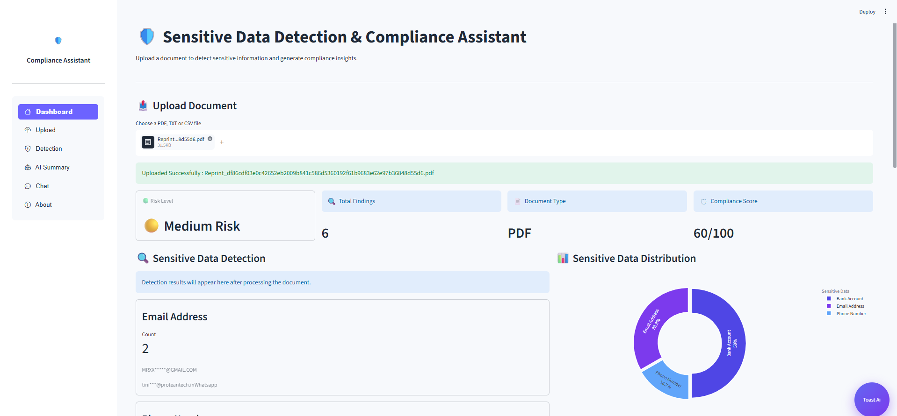
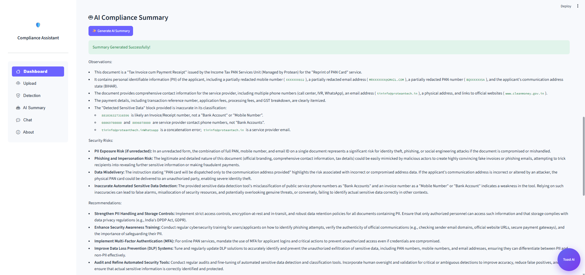
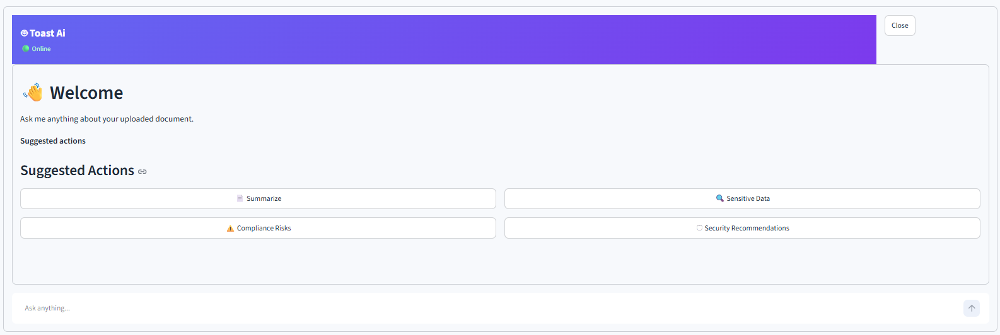
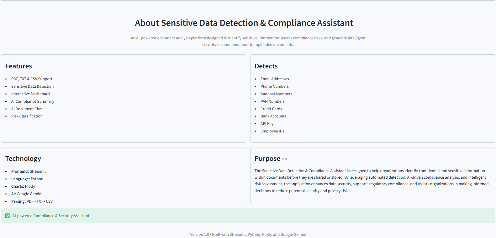

# 🛡️ Sensitive Data Detection & Compliance Assistant

An AI-powered document analysis application that detects sensitive information, classifies compliance risk, generates AI-powered compliance summaries, and enables interactive document-based question answering using Google Gemini.

---

## 📌 Overview

The **Sensitive Data Detection & Compliance Assistant** helps organizations identify confidential information in uploaded documents before they are shared or stored. The application combines pattern-based detection with AI-powered compliance analysis to improve data security and reduce privacy risks.

---

## ✨ Features

- 📄 Upload PDF, TXT, and CSV documents
- 🔍 Detect sensitive information using pattern matching
- 📊 Interactive dashboard with compliance metrics
- ⚠️ Automatic Risk Classification (Low, Medium, High)
- 📈 Compliance Score calculation
- 🥧 Interactive Plotly visualization
- 🤖 AI-generated Compliance Summary using Google Gemini
- 💬 AI Chat Assistant for document-based questions
- 🔒 Masking of detected sensitive information

---

## 🔎 Detects

The application detects common sensitive information including:

- Email Addresses
- Phone Numbers
- Aadhaar Numbers
- PAN Numbers
- Credit Card Numbers
- Bank Account Numbers
- Employee IDs
- API Keys
- Passwords
- Confidential Business Information

---

## 🛠️ Technology Stack

| Category | Technology |
|----------|------------|
| Frontend | Streamlit |
| Language | Python |
| AI Model | Google Gemini |
| Visualization | Plotly |
| Document Parsing | PyPDF, TXT, CSV |
| State Management | Streamlit Session State |

---

## 📂 Project Structure

```text
Sensitive-Data-Compliance-Assistant/
│
├── app.py
├── requirements.txt
├── assets/
│   └── style.css
├── components/
│   ├── sidebar.py
│   ├── metrics.py
│   ├── charts.py
│   ├── detection.py
│   ├── summary.py
│   ├── chat_ui.py
│   └── floating_button.py
├── utils/
│   ├── extractor.py
│   ├── detector.py
│   ├── scorer.py
│   ├── classifier.py
│   ├── summarizer.py
│   ├── chatbot.py
│   └── masker.py
└── README.md
```

---

## 🚀 Installation

Clone the repository

```bash
git clone https://github.com/yourusername/Sensitive-Data-Compliance-Assistant.git
```

Move into the project directory

```bash
cd Sensitive-Data-Compliance-Assistant
```

Install dependencies

```bash
pip install -r requirements.txt
```

Run the application

```bash
streamlit run app.py
```

---

## 🔑 Google Gemini API Key

This project uses **Google Gemini** for:

- AI Compliance Summary
- AI Document Chat

Create your API Key from:

https://aistudio.google.com/app/apikey

Enter the API key directly inside the application when prompted.

---


## 📸 Application Screenshots

### Dashboard



---

### AI Compliance Summary



---

### AI Chat Assistant



---

### About Section



---

## 🎯 Use Cases

- Compliance Audits
- Privacy Assessment
- Sensitive Data Discovery
- Document Review
- Security Risk Analysis
- Internal Compliance Checks

---

## 📈 Future Improvements

- OCR Support for scanned PDFs
- DOCX document support
- Export compliance reports as PDF
- User Authentication
- Database integration
- Multi-language document support

---

## 👨‍💻 Developed By

**Gunjan Kumar**

PG-DAC Student | Java Full Stack Developer | AI & Python Enthusiast

GitHub: https://github.com/Gunjankr078

LinkedIn: https://www.linkedin.com/in/gunjankumar078/

---

## 📄 License

This project is developed for educational and demonstration purposes.